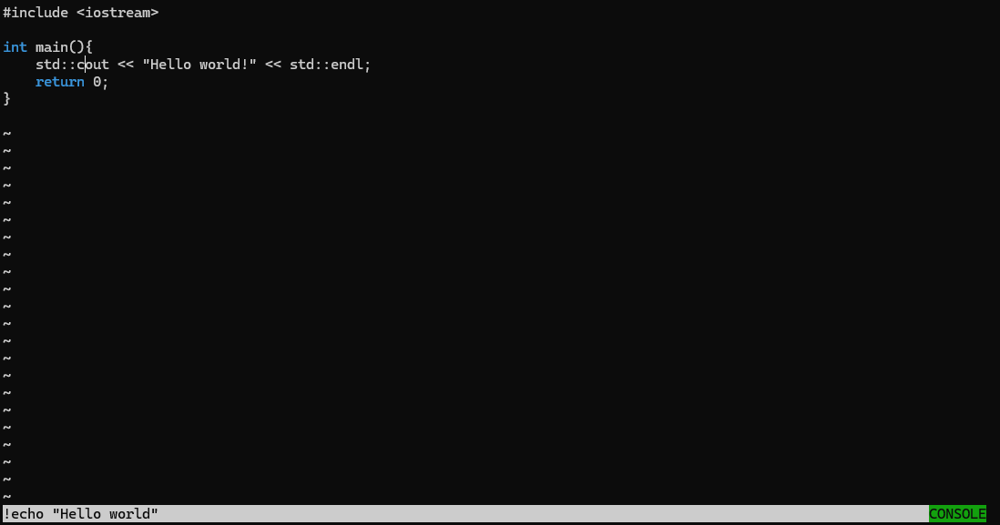

# BVim

## Table of Contents

- [Summary](#summary)
- [Installation](#installation)
- [Usage](#usage)
  - [Editor](#editor)
  - [Autocomplete](#autocomplete)
  - [Syntax Highlighting](#syntax-highlighting)
  - [Console Mode](#console-mode)
    - [Command List](#command-list)
- [Contributing](#contributing)
- [License](#license)

## Summary

**BVim** is a C++ project that includes an editor with various functionalities such as syntax highlighting, autocomplete suggestions, and file operations.
Based on the popular [VIM](https://github.com/vim/vim) editor.

## Installation

*The project only runs on Windows as of now, as it uses the Windows API* <br/>
To install and run ADTP, follow these steps:

1. Clone the repository:

   ```shell
   git clone https://github.com/yourusername/BVim.git
   ```

2. Navigate to the project directory:

    ```shell
    cd BVim
    ```

3. Open the solution file `ADTP.sln` in Visual Studio.

4. Build the solution.

## Usage

### Editor

The editor supports different modes such as NORMAL, INSERT, REPLACE, and CONSOLE.

| Function       | NORMAL Mode | INSERT Mode | REPLACE Mode | CONSOLE Mode |
|----------------|-------------|-------------|--------------|--------------|
| Insert         | ❌         | ✅          | ❌          | ❌           |
| Delete         | ✅         | ✅          | ❌          | ❌           |
| Autocomplete   | ✅         | ✅          | ✅          | ❌           |
| Auto Correct   | ❌         | ❌          | ✅          | ❌           |
| Save           | ❌         | ❌          | ❌          | ✅           |
| Quit           | ❌         | ❌          | ❌          | ✅           |
| Switching Modes| ✅         | ❌          | ❌          | ❌           |
| Entered With   | `esc`       | `i`         | `r`         | `:`           |


The upper part is the editor itself, where the user can modify file contents, the
bottom row is the status bar, where the user can enter commands and the system
can 'talk' with the user. The bottom right corner shows the current mode selected.

### Autocomplete

Provides autocomplete suggestions based on the loaded dictionary, press control while the cursor is at the end of a word you want to autocomplete.

### Syntax Highlighting

Supports syntax highlighting for different programming languages,
switching this on/off and what language to use is detailed in the
[Console Mode section](#console-mode). <br/>
You can create syntax higlighting for any programming language's key words,
by writing each one a new line of a file.
ex. c++

```c++
int
bool
break
case
catch
char
class
const
constexpr
continue
default
delete
do
[...]
```

### Console Mode

#### Command List

- `w` - write file
- `q` - quit from file
- `wq` - write file then quit
- `stx [fileName]` - turn syntax mode on/off if file is loaded, if not, load syntax file from `fileName`
- `! {command}` - runs the command on the system's shell (currently only support Windows' CMD)

 <br/>

## Contributing

Contributions are welcome! Please follow these steps to contribute:

1. Fork the repository.
2. Create a new branch:

    ```shell
    git checkout -b feature/your-feature-name
    ```

3. Make your changes and commit them:

   ```shell
   git commit -m 'Add some feature'
   ```

4. Push to the branch:

   ```shell
   git push origin feature/your-feature-name
   ```

5. Open a pull request.

## License

This project is licensed under the MIT License. See the [LICENSE](./LICENSE) file for details.
